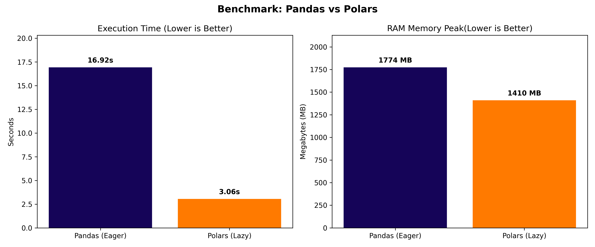

# 🚀 Data Engineering Bootcamp - Week 1: Modern Python & Polars

This repository contains the practical development of the first week of the Modern Data Engineering Bootcamp. The main focus is the transition from traditional data tools to Rust-based ecosystems to achieve high performance.

## 🎯 Project Objective
The goal of this stage was to build and validate a robust data ingestion and processing pipeline. By replacing Pandas with Polars, the pipeline can handle medium-to-large data volumes (GBs) locally, ensuring extreme efficiency in RAM usage and execution time.

## 📊 The Challenge: "The Benchmark"
To prove the efficiency of the new stack, I developed a stress-test script comparing the processing of a large dataset (NYC Taxi Dataset) using **Pandas (Eager Evaluation)** and **Polars (Lazy Evaluation)**.

The testing pipeline consisted of:
1. Reading a large CSV file (> 1GB).
2. Filtering records (trips with more than 1 passenger).
3. Aggregating data (calculating the average fare amount by pickup location).
4. Sorting the results.

### Benchmark Results
Below is the chart automatically generated by the benchmark script, highlighting the resource consumption comparison:

* **Execution Time:** Polars processed the dataset in **[16.92]s**, compared to **[3.06]s** with Pandas.
* **Memory Consumption (Peak RAM):** Polars used only **[1774]MB**, while Pandas required **[1410]MB** of system memory.

## 💼 Business Impact
Adopting Apache Arrow and Lazy Evaluation through Polars is not just a syntax improvement; it is an architectural shift that generates direct business value:
* **Cloud Infrastructure Cost Reduction:** The drastic decrease in peak RAM usage allows processing the same amount of data on significantly cheaper virtual machines.
* **Agility in Decision Making:** Reducing processing time from hours to minutes ensures that business stakeholders and Machine Learning models receive updated data much faster, mitigating operational bottlenecks.

## 🛠️ Tech Stack
* **Python 3.12+**
* **Polars** (Lazy evaluation & Zero-copy memory)
* **Pandas** (Baseline for comparison)
* **Matplotlib & Memory-Profiler** (Performance measurement and visualization)

---
*Project developed as part of continuous improvement in modern and efficient data architectures.*
